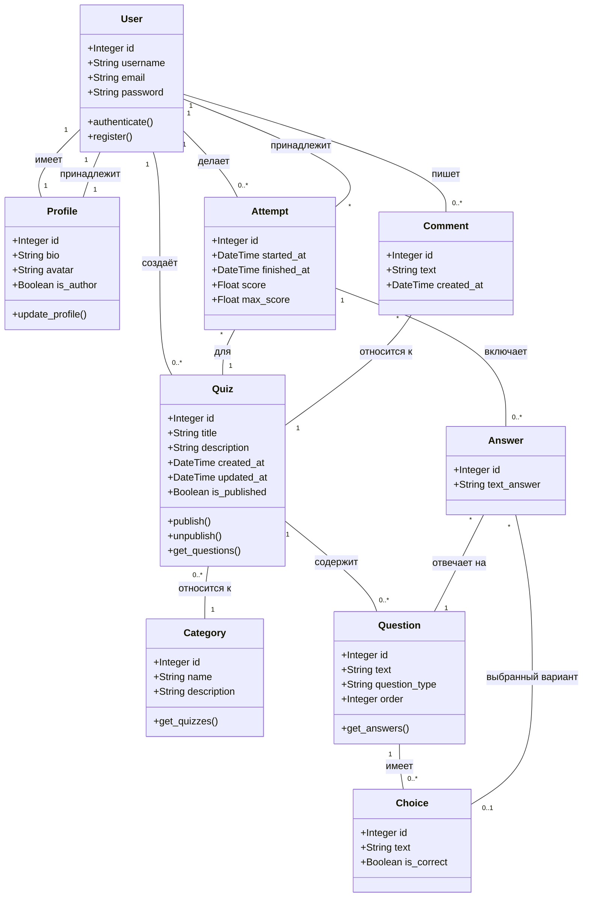
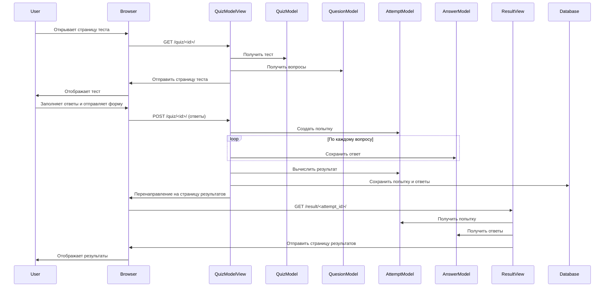
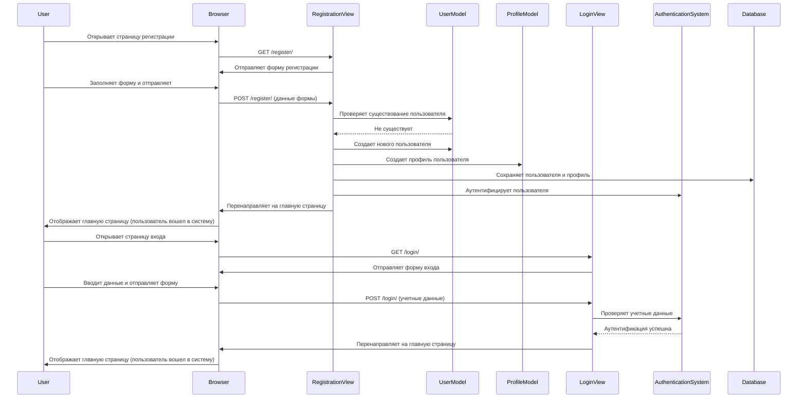

# Test-Aggregator

Веб-приложение для создания и прохождения тестов, разработанное на Django. Позволяет создавать, редактировать и проходить тесты различных категорий.

## Описание функциональности

### Для пользователей

- Регистрация и авторизация в системе
- Просмотр доступных тестов по категориям
- Прохождение тестов с различными типами вопросов:
  - Выбор одного правильного ответа
  - Выбор нескольких правильных ответов
  - Ввод текстового ответа
- Просмотр результатов прохождения тестов
- Комментирование тестов
- Просмотр истории своих попыток
- Настройка личного профиля (аватар, биография)

### Для авторов тестов

- Создание новых тестов
- Добавление вопросов различных типов
- Управление категориями тестов
- Публикация/скрытие тестов
- Просмотр статистики прохождения тестов
- Управление комментариями

### Административные функции

- Управление пользователями
- Модерация тестов и комментариев
- Просмотр общей статистики
- Управление категориями

## Установка

1. Создайте виртуальное окружение:

```bash
python -m venv env
```

2. Активируйте виртуальное окружение:

```bash
# Linux
source env/bin/activate

# Windows
./env/Scripts/activate
```

3. Установите зависимости:

```bash
pip install -r requirements.txt
```

## Запуск проекта

```bash
python manage.py runserver
```

## Структура проекта

```
Test-Aggregator/
├── assets/          # Статические файлы (CSS, JavaScript)
├── media/           # Медиафайлы (аватары пользователей)
├── quizagregator/   # Основное приложение Django
├── quizes/          # Приложение для работы с тестами
├── manage.py        # Скрипт управления Django
└── requirements.txt # Зависимости проекта
```

## Диаграмма прецедентов


## Диаграмма классов ORM



## Диаграммы последовательностей

### Прохождение теста



### Регистрация пользователя



## Разработчики

- [@Sareff](https://github.com/Sareff) - Илья
- [@Merrcurys](https://github.com/Merrcurys) - Александр

